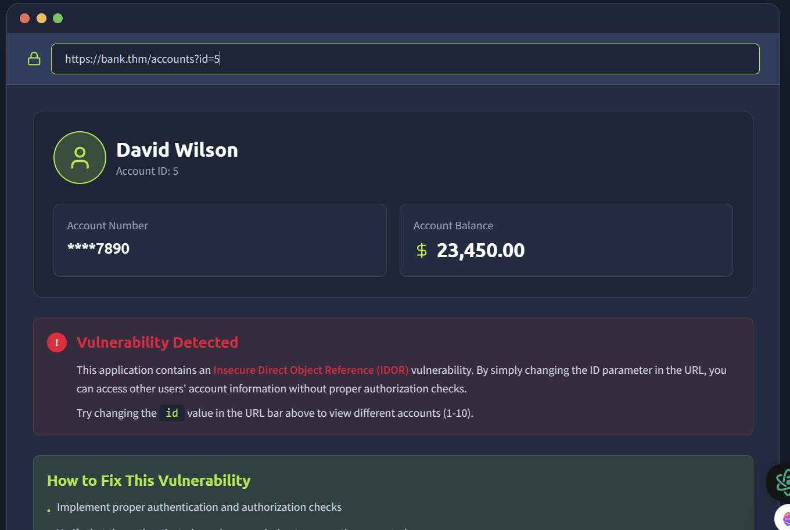
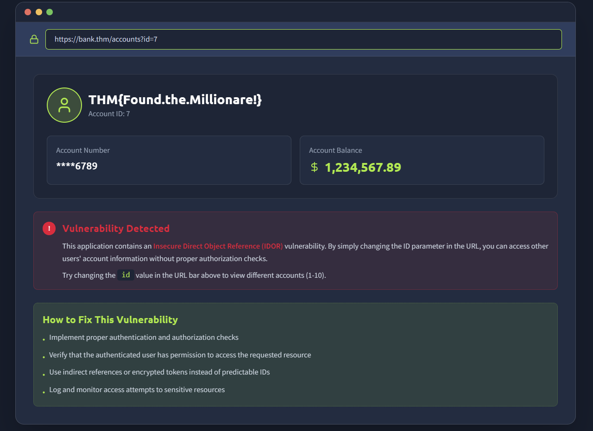
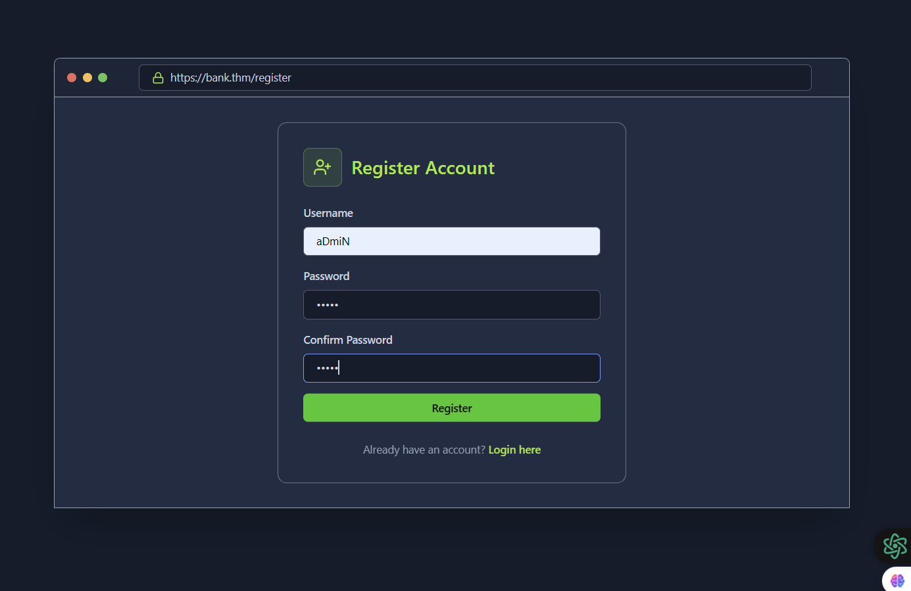
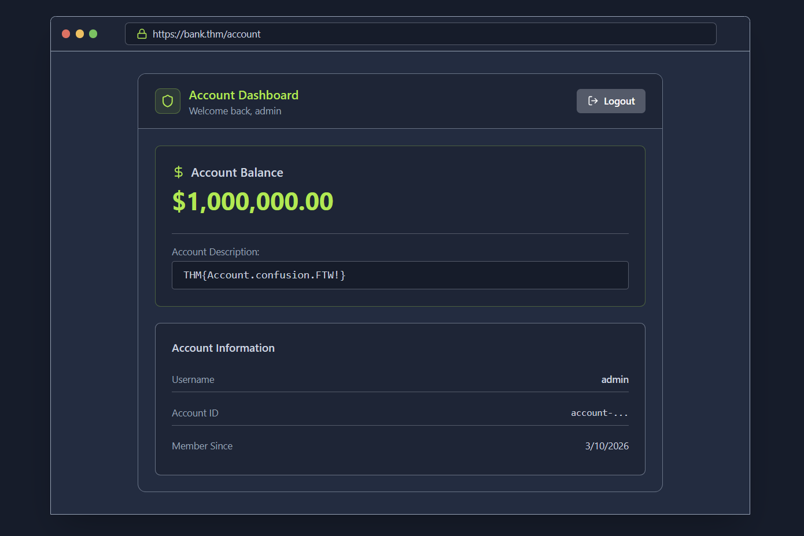
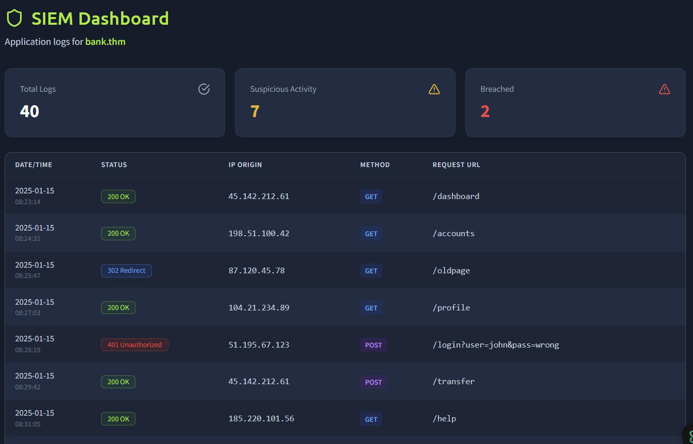
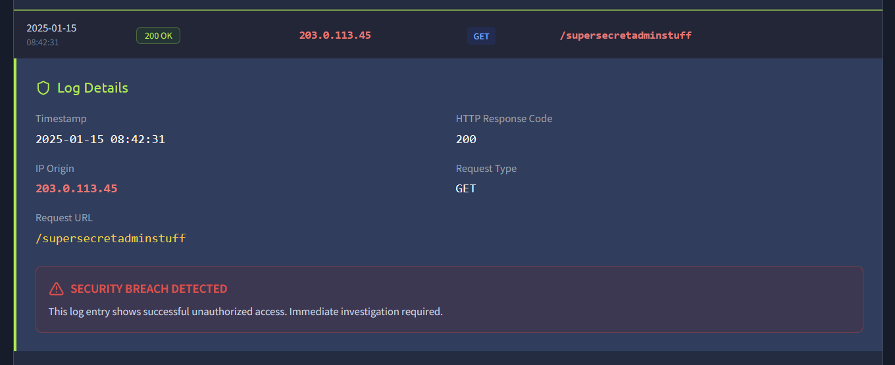

# OWASP Top 10 (2025) – IAAA Failures Lab

This repository documents a hands-on security lab exploring vulnerabilities related to Identity, Authentication, Authorization, and Accountability (IAAA).

The lab demonstrates three OWASP Top 10 categories:

A01 – Broken Access Control  
A07 – Authentication Failures  
A09 – Logging & Monitoring Failures

---

## A01 – Broken Access Control (IDOR)

The application allows users to access account data using an ID parameter in the URL.

Example:

/accounts?id=5

By modifying the value:

/accounts?id=7

It was possible to access another user's account information. This demonstrates an **Insecure Direct Object Reference (IDOR)** vulnerability.

Impact:
Unauthorized access to sensitive user data.

Screenshots:

---

## A07 – Authentication Failures

The application allowed registration of usernames that differ only by case.

Example:
admin  
aDmiN

By registering **aDmiN**, it was possible to bypass the intended authentication logic and log into the admin account.

Impact:
Authentication bypass and privilege escalation.

Screenshots:

---

## A09 – Logging & Monitoring Failures

Security logs showed multiple failed login attempts followed by a successful login, indicating a brute-force attack.

Proper logging is essential to:

• Detect attacks  
• Investigate incidents  
• Maintain accountability

Screenshots:

---

## Key Security Lessons

• Always enforce server-side authorization checks  
• Implement rate limiting and account lockout mechanisms  
• Normalize usernames during authentication  
• Maintain centralized logging and monitoring systems

---

## Tools Used

TryHackMe  
Web Browser  
Manual URL Parameter Manipulation

---

## Author

Uday Bhale  
Cybersecurity Enthusiast | Offensive Security Learner
